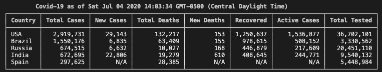
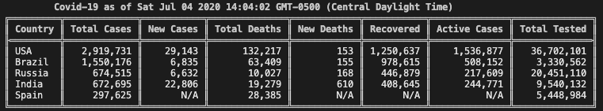
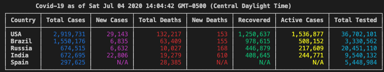
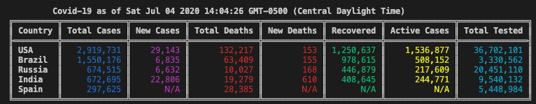

## quick easy view of the covid status globally

Install with:  
`npm i -g covtable`

Information is scraped from [WorldOMeter]('https://www.worldometers.info/coronavirus/') Please make sure to visit their site.

I merely parsed the html with [cheeriojs/cheerio]('https://github.com/cheeriojs/cheerio') and did not alter any of the statistics returned.

run with:  
<pre>
`covtable`              - this will provide a full table of all countries
`covtable --help`       - see the currently available options
`covtable -x {number}`  - number will show top x
`covtable -w`           - boolean not include the World stats
`covtable -c`           - boolean turn off color
`covtable -b`           - boolean show double line border
</pre>

### Ouput examples
  
  
  
